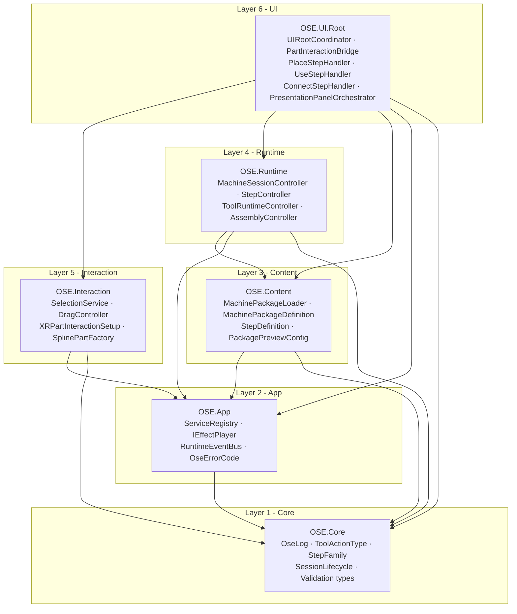

# Architecture Dependency Diagram

Visual map of the six major layers in the OSE Blueprints Assembler codebase and the direction of allowed dependencies.

**Rule:** dependencies must flow inward (toward Core). No inner layer may reference an outer layer.

---

## Layer Map

---

## Layer Responsibilities

| Layer | Namespace | Allowed to reference |
|-------|-----------|----------------------|
| 1 — Core | `OSE.Core` | Nothing (no Unity dep) |
| 2 — App | `OSE.App` | Core |
| 3 — Content | `OSE.Content` | Core, App |
| 4 — Runtime | `OSE.Runtime` | Core, App, Content |
| 5 — Interaction | `OSE.Interaction` | Core, App |
| 6 — UI | `OSE.UI.*` | All inner layers |

---

## Key Boundaries

- **Core** has zero Unity Engine imports. All types are pure C# structs, enums, and interfaces.
- **App** owns `ServiceRegistry` (the service locator) and `RuntimeEventBus` (zero-alloc event dispatch). No MonoBehaviour.
- **Content** owns the data model (`MachinePackageDefinition`, `StepDefinition`) and the loader. No MonoBehaviour except `MachinePackageLoader`.
- **Runtime** owns session lifecycle, step state machine, and tool action orchestration. Depends on Content for the data model; communicates outward via `RuntimeEventBus` events only.
- **Interaction** owns XR and mouse input, selection, and drag. Does not depend on Runtime — it raises events that Runtime handles.
- **UI** is the composition root. `UIRootCoordinator` wires all layers together. Step family handlers (`PlaceStepHandler`, `UseStepHandler`, `ConnectStepHandler`) are UI-layer orchestrators, not Runtime.

---

## Anti-patterns to avoid

- **Runtime → UI**: Runtime must never import `OSE.UI`. Communicate via `RuntimeEventBus` events.
- **Content → Runtime**: Data types must not know about session state.
- **Core → App**: Core must remain Unity-free and framework-free.
- **Interaction → UI**: Interaction layer raises events; UI layer handles them.
